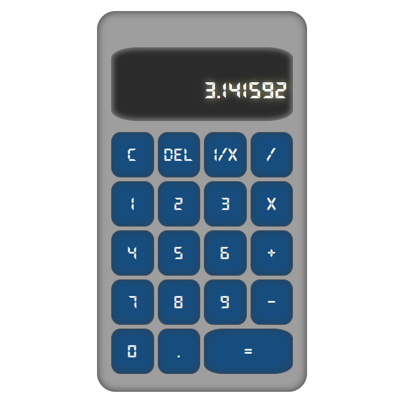

# Classic Calculator | PWA

A classic calculator app built using **Vanilla JavaScript**, **HTML**, and **CSS**. This project is a simple, fast, and installable Progressive Web App (PWA) that provides a responsive calculator experience inspired by physical calculators.

---

## 🚀 Demo

[**DEMO HERE!**](https://adarsonmez.github.io/vanilla-js-caculator/)

---

## 🖼️ Screenshot



---

## Features

- **Basic Operations:** Addition, subtraction, multiplication, division
- **Decimal Support:** Enter and calculate with decimal numbers
- **Inverse Function:** Calculate 1/x for the current value
- **Delete & Clear:** Remove last digit or clear all input
- **Responsive UI:** Layout adapts to desktop and mobile screens
- **Digital Font Styling:** Uses a digital font for authentic calculator look
- **PWA Support:** Installable and works offline via service worker

---

## Technologies Used

- JavaScript (ES6)
- HTML5
- CSS3

---

## How It Works

- All logic is implemented in a single class (`Calculator`) in `calculator.js`
- DOM manipulation is used for button handling and display updates
- The calculator supports chaining operations and immediate updates
- Service worker (`serviceWorker.js`) enables offline functionality

---

## Getting Started

1. **Clone the repository:**
   ```bash
   git clone https://github.com/adarSonmez/vanilla-js-caculator.git
   cd vanilla-js-caculator
   ```

2. **Open `index.html` in your browser.**

   The calculator will load and can be used directly, even offline after first visit.

---

## Project Structure

```
vanilla-js-caculator/
├── index.html
├── calculator.js
├── style.css
├── serviceWorker.js
├── fonts/
│   └── DS-DIGIB.TTF
├── media/
│   └── calculator.png
```

---

## Author

Created by [adarSonmez](https://github.com/adarSonmez)
